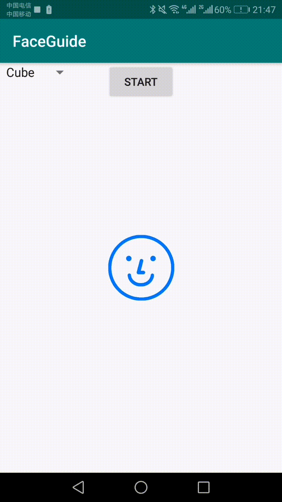
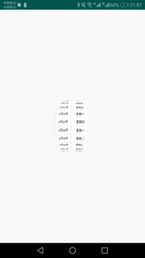
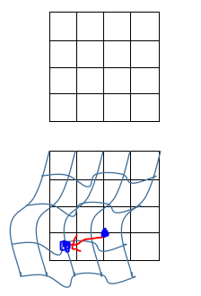
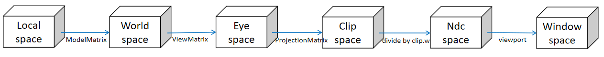
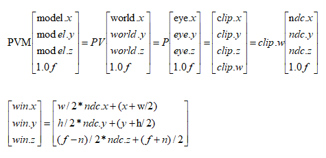
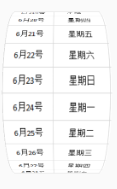

# 0x0、必备知识
  阅读本文之前，读者最好具备一定的OpenGL的开发背景，并了解OpenGL渲染流程。学习资源可以参考：
  - [Learn OpenGL](https://learnopengl.com/)
  - [OpenGL - Song Ho Ahn](http://www.songho.ca/opengl/index.html)

# 0x1、背景介绍
  在项目开发中，经常需要开发一些炫酷的3D效果。在Android系统上，通常来说可以通过系统提供的OpenGL的java接口来实现（如GLES20.java）。android系统并提供了GLSurfaceView等一套框架机制，直接帮助开发者将gl环境准备好，开发者剩下的工作就是建立模型（model）、设计着色算法（shader）。但是GLSurfaceView整套机制相对来说还是比较重型（独立的gl渲染线程），功耗也比较大。然而有这么一些非常简单的3D特效，直接嵌入在用户交互界面里，对功耗的要求尽量要低，这个时候采用GLSrufaceView那套机制并不合适。
    
  经过一些调研，发现android原生的接口Canvas.drawBitmapMesh提供的能力可以帮助实现在任意view上的3D效果。本文介绍的内容就是：如果将OpengGL中建模以及渲染流程的知识和接口Canvas.drawBitmapMesh结合起来，并开发一个小的“渲染引擎”，将这种能力基线化。
    
  **示例**  

 

    
# 0x2、原理介绍

## Mesh原理


## Canvas.drawBitmapMesh

```
 /**
 * Draw the bitmap through the mesh, where mesh vertices are evenly distributed across the
 * bitmap. There are meshWidth+1 vertices across, and meshHeight+1 vertices down. The verts
 * array is accessed in row-major order, so that the first meshWidth+1 vertices are distributed
 * across the top of the bitmap from left to right. A more general version of this method is
 * drawVertices().
 *
 * Prior to API level {@value Build.VERSION_CODES#P} vertOffset and colorOffset were ignored,
 * effectively treating them as zeros. In API level {@value Build.VERSION_CODES#P} and above
 * these parameters will be respected.
 *
 * @param bitmap The bitmap to draw using the mesh
 * @param meshWidth The number of columns in the mesh. Nothing is drawn if this is 0
 * @param meshHeight The number of rows in the mesh. Nothing is drawn if this is 0
 * @param verts Array of x,y pairs, specifying where the mesh should be drawn. There must be at
 *            least (meshWidth+1) * (meshHeight+1) * 2 + vertOffset values in the array
 * @param vertOffset Number of verts elements to skip before drawing
 * @param colors May be null. Specifies a color at each vertex, which is interpolated across the
 *            cell, and whose values are multiplied by the corresponding bitmap colors. If not
 *            null, there must be at least (meshWidth+1) * (meshHeight+1) + colorOffset values
 *            in the array.
 * @param colorOffset Number of color elements to skip before drawing
 * @param paint May be null. The paint used to draw the bitmap
 */
public void drawBitmapMesh(@NonNull Bitmap bitmap, int meshWidth, int meshHeight,
        @NonNull float[] verts, int vertOffset, @Nullable int[] colors, int colorOffset,
        @Nullable Paint paint) {
    super.drawBitmapMesh(bitmap, meshWidth, meshHeight, verts, vertOffset, colors, colorOffset,
            paint);
}
```

- `bitmap`：类似于gl中的texture
- `meshWidth`：网格纵切的数目
- `meshHeight`：网格横切的数目
- `verts`：类似于gl中的vertex array
- `vertOffset`
- `colors`：可用来模拟mask（未demo测试）
- `colorOffset`
- `paint`

## OpenGl的建模和渲染过程

OpenGL中vertex transformation：



对应的计算过程：


通常来讲，通过OpenGL开放的接口，实现3D效果（不考虑着色），需要提供：
- local space建模数据：即vertex array in local space
- MVP matrix：Model matrix, View matrix, Project matrix
- 视窗：即viewport


# 三、Github工程 & 简介
**工程地址**
https://github.com/hanxiatu-fc/MeshView

**简介**

| MeshObject提供的接口 | 对应模拟的android系统接口 |
| ------ | ------ |
| viewport | android.opengl.GLES.viewport|
| ortho | android.opengl.Matrix.orthoM |
| frustum | android.opengl.Matrix.frustumM |
| perspective | android.opengl.Matrix.perspectiveM |
| setLookAt | android.opengl.Matrix.setLookAtM|


# 四、遗留问题

- 目前只是简单的模拟了OpenGL背后的渲染流程，一些高级特性不具备。例如利用深度信息判断点的前后关系并裁剪的能力不具备。这样就要求使用者精确建模，避免出现有不同深度信息的点，否者绘制顺序无法保证最前面的点被后绘制（看到的现象就是物体背后的信息发生了穿透）

  例如下图中，右边的示例底部发生了穿透现象。

   

- 目前本篇博客细节介绍的并不详细，待完善