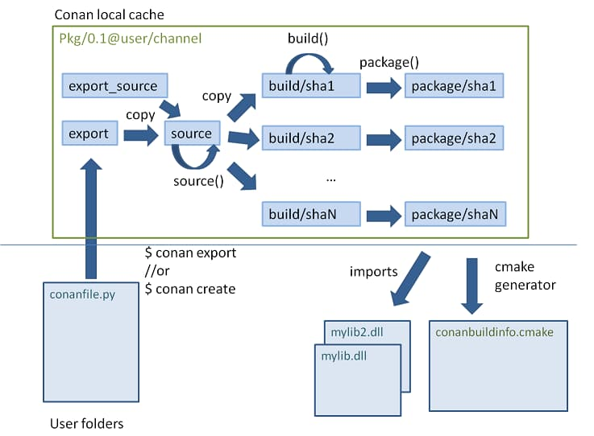

## 0x0 Creating Packaging

### 创建recipe
```
$ conan new xx
$ 编辑 conanfile.py
```
[conanfile.py 语法](https://docs.conan.io/en/latest/reference/conanfile.html#conanfile-reference)

**源码和recipe的组织方式**
||方式1|方式2|
|---|---|---|
|同仓|[exports_sources](https://docs.conan.io/en/latest/reference/conanfile/attributes.html#exports-sources)='src/*' |[scm attribute](https://docs.conan.io/en/latest/reference/conanfile/attributes.html#scm-attribute)|
|不同仓|[source()](https://docs.conan.io/en/latest/reference/conanfile/methods.html#source)|[scm attribute](https://docs.conan.io/en/latest/reference/conanfile/attributes.html#scm-attribute)|

**Packaging Existing Binaries**
```
conan export-pkg xx
```

### 创建和测试Packages
```
$ conan create . demo/testing
```
**如上命令相当于执行（一个完整的测试过程）**
- 将 `conanfile.py` 拷贝到本地缓存
- 从源码构建并安装包
- 进入test_package目录，创建一个临时的构建目录
- 执行 `conan install ..`, 安装 `test_package/conanfile.py`的依赖（就是我们要测试的包）
- 构建和执行,即调用 `test_package/conanfile.py` 的 `build()` 和 `test()` 

*注：这里的测试只是测试package是否被正确创建*

## 0x1 Understanding Packaging

**每个recipe在本地缓存定义了5个重要目录**
- `export`: 存放recipe的目录.
- `export_source`: 存放由属性`exports_sources`定义的源码
- `source`: 存放由函数`source()`定义的源码.
- `build`: 编译目录，为不同的配置创建不同的子目录
- `package`: 存放最终二进制的目录，为不同的配置创建不同的子目录

**执行流程**


- 将`exports_sources`，`export`，`source()`定义的源码均copy到本地缓存的`source/`目录下。（注意源码一般只有一套，如果需要为不同的配置定制资源，则应该将源码收集的逻辑从source()函数挪到build()函数）
- 根据配置信息（settings、options）生成package-id（SHA-1 hash），创建对应子目录并执行build()函数
- 执行package()函数，将`build/hashXXX`中生成的二进制拷贝到`package/hashXXX`
- 执行package_info()函数，收集待使用的信息，如`conanbuildinfo.cmake`
- `imports` feature触发将二进制从本地换成拷贝到使用者的目录 

## 0x2 ABI

**One recipe -> N binary packages**  
依赖于如下三个因素：
- settings
- options
- requires 默认遵从[Semantic Versioning](https://semver.org/) 的设定


**self.info.xx**
通过 `self.info.xx` 定制settings、options、requires信息，来控制 `package_id()` 返回的Package ID。例如：

- self.info.settings.xx
- self.info.options.xx
- self.info.requires or self.info.requires[xx],其中可配置的模式如下表

|Modes/Variables|name|version|user|channel|package_id|RREV|PREV|
|---|---|---|---|---|---|---|---|
|semver_direct_mode()|Yes|Yes, only > 1.0.0 (e.g., 1.2.Z+b102)|No|No|No|No|No|
|semver_mode()|Yes|Yes, only > 1.0.0 (e.g., 1.2.Z+b102)|No|No|No|No|No|
|major_mode()|Yes|Yes (e.g., 1.2.Z+b102)|No|No|No|No|No|
|minor_mode()|Yes|Yes (e.g., 1.2.Z+b102)|No|No|No|No|No|
|patch_mode()|Yes|Yes (e.g., 1.2.3+b102)|No|No|No|No|No|
|base_mode()|Yes|Yes (e.g., 1.7+b102)|No|No|No|No|No|
|full_version_mode()|Yes|Yes (e.g., 1.2.3+b102)|No|No|No|No|No|
|full_recipe_mode()|Yes|Yes (e.g., 1.2.3+b102)|Yes|Yes|No|No|No|
|full_package_mode()|Yes|Yes (e.g., 1.2.3+b102)|Yes|Yes|Yes|No|No|
|unrelated_mode()|No|No|No|No|No|No|No|
|recipe_revision_mode()|Yes|Yes|Yes|Yes|Yes|Yes|No|
|package_revision_mode()|Yes|Yes|Yes|Yes|Yes|Yes|Yes|
## 0x3 参考链接
1. [Conan:Creating Packages](https://docs.conan.io/en/latest/creating_packages.html)