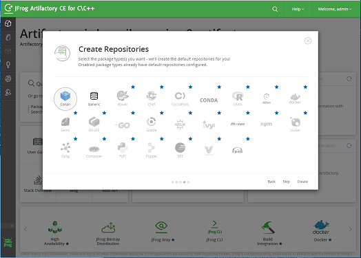
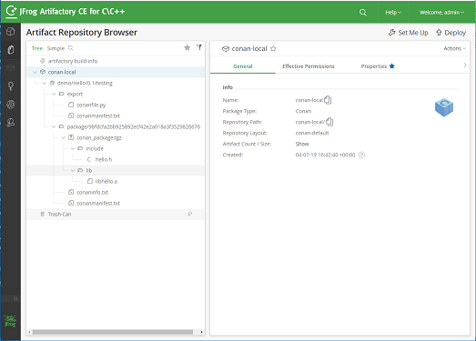

# 0x0 安装本地Artifactory服务

1. 下载jfrog-artifactory-cpp-ce-6.8.15.zip
https://bintray.com/jfrog/product/JFrog-Artifactory-Cpp-CE/view

2. 启动服务
```
(win)
$ 解压 jfrog-artifactory-cpp-ce-6.8.15.zip
$ cd artifactory-cpp-ce-6.8.15/bin
$ artifactory.bat

(linux)
$ 解压 jfrog-artifactory-cpp-ce-6.8.15.zip
$ cd artifactory-cpp-ce-6.8.15/bin
$ ./artifactory.sh
```
*注：  
需要配置JAVA_HOME、JRE_HOME， 否则可以启动失败，如报错“java执行失败”。注意，在windows如果自己安装了java，可将系统默认安装的卸载掉，这样方便设置 JAVA_HOME和JRE_HOME*

3. 登陆查看 http://localhost:8081/artifactory

# 0x1 配置

- 默认账户
账号：`admin`
密码：`password`

- 配置conan仓库（服务启动之后，按照网页提示操作）



- To add the repository to your conan CLI
```
conan remote add <REMOTE> http://localhost:8081/artifactory/api/conan/conan-local


例如：
conan remote add connan_linux http://localhost:8081/artifactory/api/conan/conan-local
```

- To login use the conan user command
```
conan user -p <PASSWORD> -r <REMOTE> <USERNAME>

例如：
conan user -p password -r connan_linux admin
```

# 0x2 创建demo & 构建 & 上传

- 创建demo&构建
```
conan new <NAME>/<VERSION> -t
例如：
conan new Hello/0.1 -t


conan create . <USER>/<CHANNEL>
例如：
conan create . demo/testing
```
- deploy
```
conan upload <recipe> -r <REMOTE> --all

<recipe>  格式: <NAME>/<VERSION>@<USER>/<CHANNEL>

例如：
conan upload Hello/0.1@demo/testing --all -r=connan_linux
```

## 效果


# 0x3 参考链接
1. https://jfrog.com/blog/announcing-jfrog-artifactory-community-edition-c-c/

2. https://www.cnblogs.com/rongfengliang/p/9229462.html
