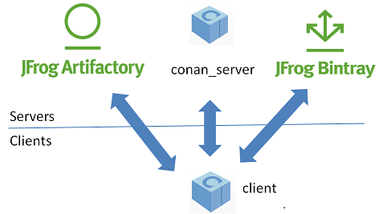
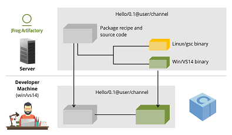

# 0x0 Introduction & Install
Conan is OSS, with an MIT license.

Conan项目有如下几个值得关注的地方：
1. 分布式包管理（Decentralized package manager）


| Server | 场景 | 特点 |
| ---- | ---- | ---- |
| Conan server | private | Conan client&server都是OSS, MIT license，可随意修改使用 |
| JFrog Artifactory | private | 更好的服务 |
| JFrog Bintray | public | 共享 |

2. 二进制的管理方法（Binary Manage）

- 服务端是一对多的模式：`recipe + binaries`
- 使用者获取 “recipe + 适合的binary”


3. 跨平台&支持多种构建系统（Cross platform, build system agnostic）
- os（compiler） + arch
- Conan可以和任意一种build system配合使用。常用的如Cmake

## 安装
```
pip install conan
```

# 0x1 Get Started (以Cmake为例)

1. 准备一个基本的工程
2. 准备conanfile.txt¶
```
 [requires]
 Poco/1.9.0@pocoproject/stable

 [generators]
 cmake
```
3. conna install <conanfile.txt path>
4.  CMakeLists.txt 集成上一步的输出 : conanbuildinfo.cmake
```
 include(${CMAKE_BINARY_DIR}/conanbuildinfo.cmake)
 conan_basic_setup()
```
5. Cmake config & build

# 0x2 参考链接

1. [Conan : Introduction](https://docs.conan.io/en/latest/introduction.html)
2. [Conan : Install](https://docs.conan.io/en/latest/installation.html)
3. [Conan : Get Started](https://docs.conan.io/en/latest/getting_started.html)
4. [Continuous Integration for C/C++ Projects with Jenkins and Conan](https://jenkins.io/blog/2017/07/07/jenkins-conan/)