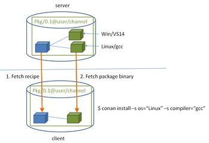
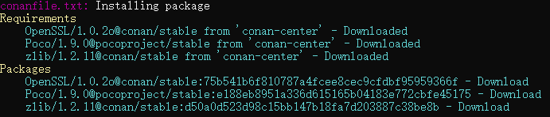
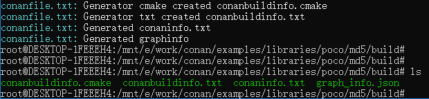
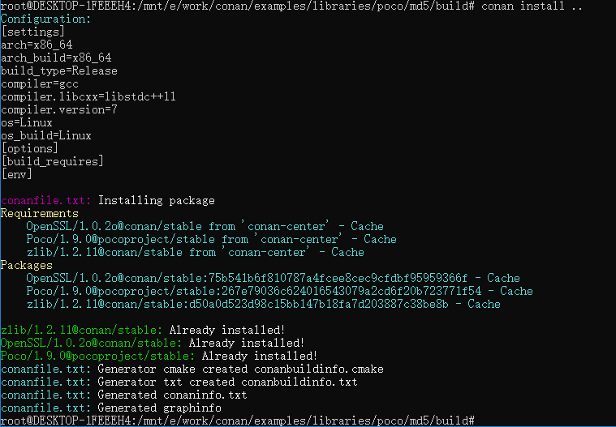
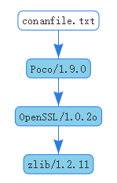
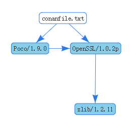

# 0x0 Installing dependencies

## 在conanfile.txt中定义
```
# <NAME>/<VERSION>@<USER>/<CHANNEL>
[requires]
Poco/1.9.0@pocoproject/stable
```

## 执行 canan install
```
conan install [path of conanfile.txt]
```



**install的过程**
- 检查本地cache中是否有该package recipe。
- 如果在本地cache中未找到该pacakge recipe，则到定义的remotes中查找该package recipe（默认是conan-center，在前面的文章中还添加了一个本地的remote ： conan-local）
- 如果找到对应的recipe，客户端则下载recipe，并存储到本地cache
- 依据 `recipe + input settings (Linux, GCC)`, 在本地cache查找对应的binary.
- 如果在本地cache中未找到对应binary，则到remotes中查找并下载。
- 最后，使用定义 generators 为build system生成适当的文件，例如`conanbuildinfo.cmake`

**conan install 从conan-center下载**



**conan install 生成的文件**



- conanbuildinfo.cmake 
  由Generator（本例使用的是cmake）产生，定义一些变量及方法，可供user的CMakeLists.txt使用
- conanbuildinfo.txt
  描述性信息，方便程序员查看
- [conaninfo.txt](https://docs.conan.io/en/latest/reference/conanfile_txt.html)
  Reference for `conanfile.txt` sections: requires, generators, etc.
- graph_info.json

**已cache后，执行conan install的效果**



## transitive dependencies的处理
- demo工程显示依赖Poco
- Poco依赖OpenSSL
- OpenSSL依赖zlib
在执行canon install的过程中所以依赖都被处理


**override dependencies**

1. 修改conanfile.txt，显示依赖： OpenSSL/1.0.2p@conan/stable
```
[requires]
Poco/1.9.0@pocoproject/stable
OpenSSL/1.0.2p@conan/stable
```
2. 使用 conan info [path of conanfile.txt] --graph=file.html 查看变化
- log
```
WARN: Poco/1.9.0@pocoproject/stable requirement OpenSSL/1.0.2o@conan/stable overridden by your conanfile to OpenSSL/1.0.2p@conan/stable
```
- dependencies



# 0x1 更多定制化选择

## settings vs options

**二者的区别**
- settings 是project-wide configuration
- options 是package specific configuration

**settings的使用**

可配置settings属性定义在 `.conan/settings.yml`

一般可以在.conan/profiles/default中编辑默认的settings信息
```
[settings]
os=Linux
os_build=Linux
arch=x86_64
arch_build=x86_64
compiler=gcc
compiler.version=7
compiler.libcxx=libstdc++11
build_type=Release
```
也可以在命令中指定
```
$ conan install . --settings arch=x86
```

**options的使用**

一般可以在recipe中配置
```
[requires]
Poco/1.9.0@pocoproject/stable

[generators]
cmake

[options]
Poco:shared=True # PACKAGE:OPTION=VALUE
OpenSSL:shared=True
```
也可以在命令中指定
```
$ conan install .. -o Poco:shared=True -o OpenSSL:shared=True
# or even with wildcards, to apply to many packages
$ conan install .. -o *:shared=True
```
## profiles

**用途**
profile可用来定制 `settings`, `options`, `environment variables`, 和 `build_requires`,例如：
```
[settings]
setting=value

[options]
MyLib:shared=True

[env]
env_var=value

[build_requires]
Tool1/0.1@user/channel
Tool2/0.1@user/channel, Tool3/0.1@user/channel
*: Tool4/0.1@user/channel
```

**编辑和定制**
一般有一个默认的profile ： `~/.conan/profiles/default`
也可以通过命令指定自定义的profile文件：
```
$ conan install . -pr=debug_shared
```
而且可以同时指定多个profile文件：
```
$ conan install . -pr=./poco_clang_3.5 -pr=my_build_tool1 -pr=my_build_tool2
```

## workflow
可以通过 `--install-folder` 或 `-if` 指定build（放输出的地方）目录。这样不同配置的build之间可以做到隔离。官网给的例子：
```
$ git clone https://github.com/memsharded/example-poco-timer
$ conan install example-poco-timer -s build_type=Debug -if example-poco-build/debug
$ conan install example-poco-timer -s build_type=Release -if example-poco-build/release
```
生成的目录结构
```
example-poco-build
  debug
      conaninfo.txt
      conanbuildinfo.txt
      conanbuildinfo.cmake
      CMakeCache.txt # and other cmake files
  release
      conaninfo.txt
      conanbuildinfo.txt
      conanbuildinfo.cmake
      CMakeCache.txt # and other cmake files
example-poco-timer
    CMakeLists.txt  # If using cmake, but can be Makefile, sln...
    LICENSE
    README.md
    conanfile.txt
    timer.cpp
```
debug 和 release的输出文件是隔离的，不会形成冲突，另外clean也很方便。


# 参考链接
1. [Conan: Get Started / installing-dependencies](https://docs.conan.io/en/latest/getting_started.html#installing-dependencies)

2. [Conan: Using packages](https://docs.conan.io/en/latest/using_packages.html)