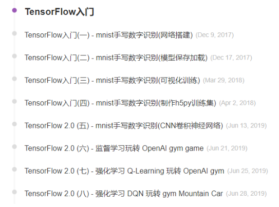

在这里不是想讨论如何做一个有趣的人的方法论，就是谈谈近期的一些感悟。

文章的标题还可以是`做一个优秀的人`、`做一个有魅力的人`......诸如此类。为什么要选择有趣呢？大概是`有趣`这个词即可以让自己鼓噪起来，又显得气氛轻松。

为什么想到想到这个话题呢？

当你的身边有一些优秀的人的时候，是一件多么有趣的事！我是幸运的，在去年的7月，陆续和一些优秀的人聚到了一个团队中。有两个特别有趣的小伙伴我想在这里介绍一下（也是我做出本文思考的来源）：

## geek

有一个非常geek的小伙伴：年轻、有激情。最近他在玩博客（而我开始写个人博客，也是受其影响）。相比于我还是毛毛雨，他已经玩出了各种花样：
- 自定义的主题 --> 极致的加载速度
  https://github.com/geektutu/hexo-theme-geektutu
- 独立的思考：看到问题，提出思考，给出解决
  https://geektutu.com/post/blog-experience-1.html 系列
- 有深度的专题《TensorFlow入门》
  https://geektutu.com/post/tensorflow-mnist-simplest.html 系列
  

在这些背后他其实付出了很多的观察，思考和努力。有时候会‘爆肝’赶文章，每一篇技术文章都是精心制作，而一些感悟的文章又是非常独具思考。

## 文艺

另外一个小伙伴则是一个非常文艺的诗人（今天才知道他写诗，就这么叫吧）。本来只知道他读书很多，理智、细腻、有文艺范儿。

今天有幸拜读了他的博客 http://hutusi.com/ ，很多篇文章我都蛮喜欢的。
- [陪产记](http://hutusi.com/blog/2015/06/21/paternity) 写的很细腻，很多描写犹如在眼前，我最先读的一篇文章。
- [四月莎士比亚](http://hutusi.com/blog/2010/08/22/shakespeare) 标题很诗意，每篇的点评也很有趣。很羡慕可以静心读书的人。
- [一只特立独行的猪](http://hutusi.com/blog/2007/04/11/wangxiaobo) 哈哈，这篇颇有王小波的幽默感。
  *同样王小波也不会喜欢众多无聊的人对自己的裸体指指点点吧。他可能会这么幽默的跟塑像作者说：你丫也没见过我啥模样，这尺寸标准么？这样多少有些轻薄，我更愿意他这么说：你总不能让我一年四季都光着身子吧。*
  *这中间有你的亲人，有你的粉丝，还有一大群不着边际吃饱了饭寻求刺激的人，他们说：小波的裸体我不乐意看，要看就看大波。*
- [爱美丽、黑暗王子和豌豆公主](http://hutusi.com/blog/2007/03/04/dream) 奇怪的梦，有趣的连接，美丽的兴趣
- [诗歌与烟台](http://hutusi.com/blog/2007/02/27/yantai) 
- ......

哦，对了。他的博客很久没有更新，他自己也打算重新拎起来，作为follower，可以去催更了。

## 一点思考

看到别人有趣而精彩的人生，不免有些羡慕。我看到的是无论geek和文艺，这背后都有他们长期以往的坚持以及为此付出的时间。

而我的时间哪里去了呢？

回想过往，我的时间在这里
- 学习和工作
- 足球
- 微博 + 其他信息流
- 一些漫无目的的事

学习和工作不在这里讨论。足球上花的时间总是值得的。

微博应该减少，作为获取足球信息和一些基本新闻的渠道可以，但是不要总是去反复刷。

其实过往一些零碎的时间利用的不是很好，很多都淹没在一些无意思的信息流产品上，今后多花点时间写博客，多读书。

就像文艺的诗人所说，读书可以给自己提供`素材`，只要多读，这些东西就会印在脑海里，写作可以锻炼思维，触发思考。

不知道是不是这样就会成为一个有趣的人，也许，跑题了。

## 后记

为什么写这篇博文，一是有了点小感悟。觉得写下来也无妨，而是在朋友的影响下，确实想好好写一些博客，一方面对自己的学习和感悟做记录，另一方面也许可以对互联网世界贡献一些自己的知识。

可以写下来，发现博客真的很，尤其以技术博文为主的话。第一篇技术博客文章+工程花费了一个多星期。后面的博文迟迟也没有想好写什么，没有那位geek小伙伴的极大的热情，也没有他肚子里装满的干货。但不管怎样，先写一篇感悟‘滥竽充数’，后面的文章要加油了！！！
